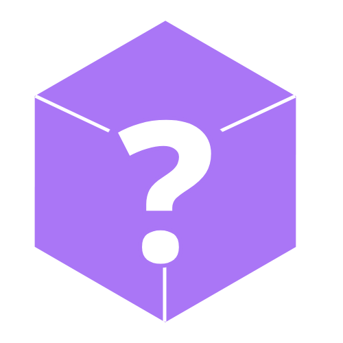
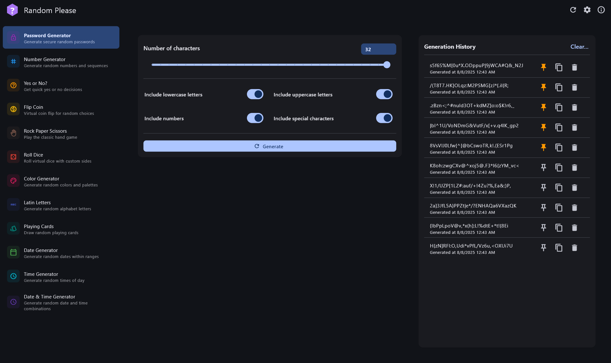
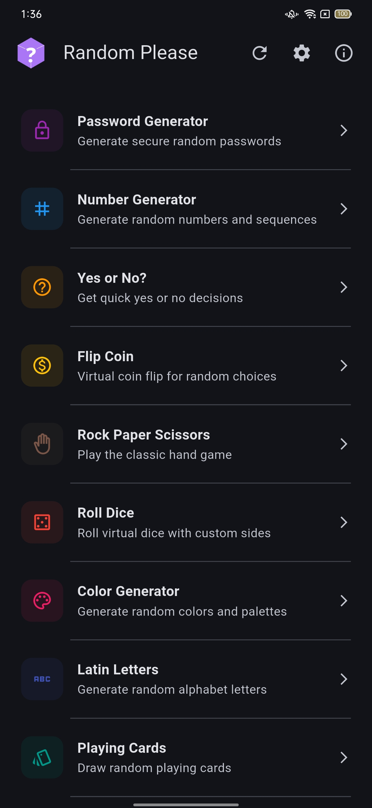
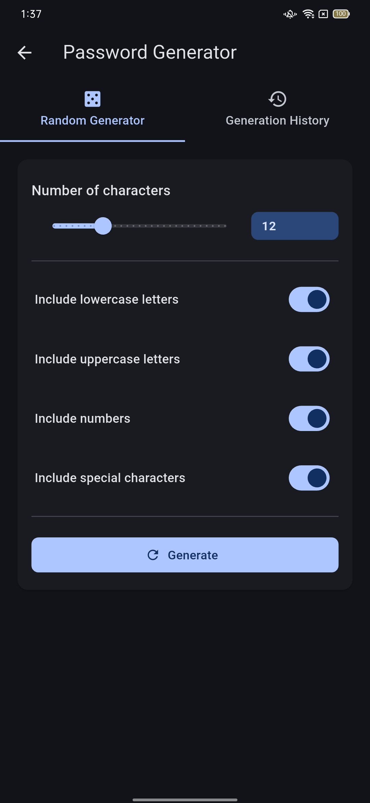
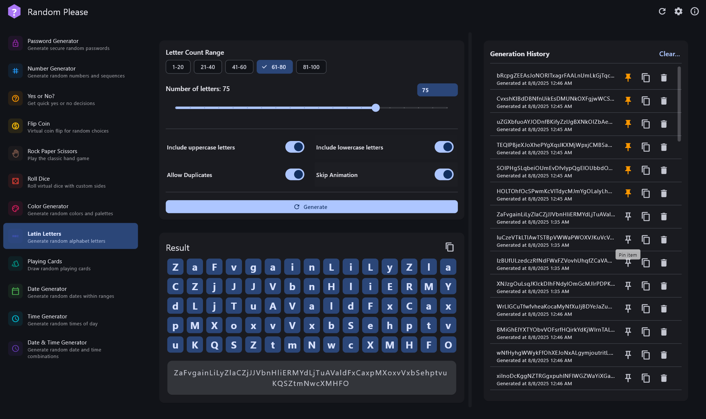
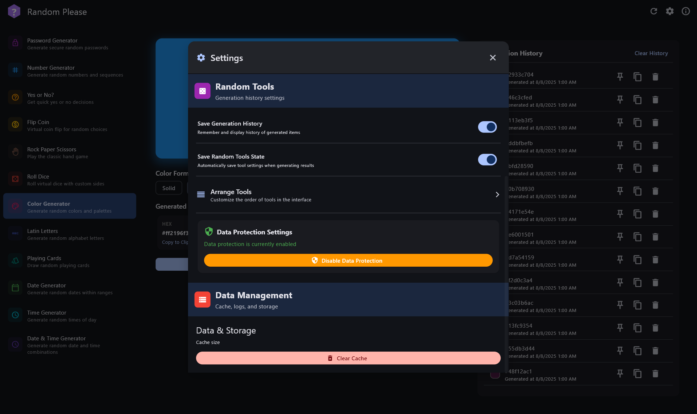

<div align="center">
    
    <h1>Random Please</h1>
    <h3>Convenient randomizer tool that can help you anytime</h3> 
</div>

**A comprehensive collection of random generators and utilities!** A powerful, cross-platform Flutter application designed to provide essential randomization tools and utilities for daily use - from secure password generation to mathematical calculations and unit conversions.

## 📸 Screenshot

<div align="center">
    
    
    
    
    
    
</div>

✨ **Available on Windows, Android, and Web**  
🌍 **Fully localized in English and Vietnamese**  
📱 **Responsive Material Design 3 interface for all screen sizes**

---

## 🚀 Core Features

### 🎲 **Random Generator Suite** 
*12+ powerful randomization tools for every scenario!*

**🔐 Security & Passwords**
- **Password Generator:** Military-grade secure passwords with customizable complexity
- **Latin Letter Generator:** Random letter sequences with range selection

**🔢 Numbers & Mathematics**
- **Number Generator:** Integers, decimals, ranges with duplicate control
- **Dice Roll Generator:** Multi-dice rolling with 4 to 100-sided dice
- **Coin Flip & Decision Makers:** Binary choices, yes/no decisions

**🎮 Creative & Gaming**
- **Color Generator:** Random HEX colors for design projects
- **Card Generator:** Playing card draws with deck management
- **Text Generator:** Lorem ipsum and random text creation

**📅 Date & Time Tools**
- **Date Generator:** Random dates within specified ranges
- **Time Generator:** Random time generation with precision control

---

## 🏗️ **Technical Architecture**

### 🛠️ **Built with Modern Flutter**
- **Flutter 3.0+:** Cross-platform development with single codebase
- **Material Design 3:** Latest Google design system implementation
- **Responsive Layouts:** Adaptive UI for mobile, tablet, and desktop

### 📚 **Key Dependencies**
- **Hive:** Fast, lightweight local database for settings and history
- **intl:** Internationalization and locale-specific formatting
- **math_expressions:** Mathematical expression parsing and evaluation
- **shared_preferences:** System-level preference storage

### 🔒 **Security & Privacy**
- **Local Storage:** All sensitive data remains on device
- **Secure Random:** Cryptographically secure random number generation
- **No Tracking:** Zero analytics or user behavior monitoring
- **Offline Capable:** Core functionality works without internet

### 🌐 **Cross-Platform Support**
- **Windows:** Full desktop experience with window management
- **Android:** Native mobile interface with quick actions
- **Web:** Browser-compatible version with responsive design
- **Future:** iOS and macOS support planned

---

## 🌟 **Key Advantages**

### ⚡ **Performance Optimized**
- Lightning-fast calculations and generations
- Minimal memory footprint with efficient algorithms
- Smooth 60fps animations and transitions
- Instant startup and response times

### 🎨 **User Experience**
- Intuitive Material Design 3 interface
- Consistent experience across all platforms
- Customizable tool visibility and ordering
- Contextual help and guidance

### ⚙️ **Highly Configurable**
- Extensive settings for personalizing experience
- Tool-specific configuration options
- Import/export settings for backup
- Compact mode for space-constrained devices

### 🌐 **Accessibility & Localization**
- Vietnamese and English localization
- Screen reader compatibility
- High contrast mode support
- Keyboard navigation support

---

## 🛠️ **Installation & Setup**

### 🚀 **Getting Started**
1. **Download:** Get the latest release for your platform
2. **Install:** Follow platform-specific installation instructions
3. **Configure:** Set your preferred language and theme
4. **Customize:** Arrange tools according to your needs

### 🖥️ **System Requirements**
- **Windows:** Windows 10 1903 or later
- **Android:** Android 7.0 (API level 24) or higher
- **Web:** Modern browser with JavaScript enabled
- **RAM:** Minimum 2GB available memory

---

## 📁 Project Structure

```
lib/
├── main.dart                    # App entry point
├── controllers/                 # P2P and state management
├── models/                      # Data models and schemas
├── services/                    # Core services
├── screens/                     # App screens and UI
├── widgets/                     # Reusable UI components
├── layouts/                     # Layout components
├── utils/                       # Helper functions
└── l10n/                        # Localization files
```
---

## ❤️ Donate to this project

You can donate either via [**Github Sponsor**](https://github.com/sponsors/TrongAJTT/) or [**Buy me a coffee**](https://www.buymeacoffee.com/trongajtt) (write your feelings about the application).

More details about inside the app.

## 🤝 Contributing

Contributions are welcome! Feel free to:
- Report bugs and issues
- Suggest new features
- Improve translation
- Improve documentation

## 📄 License

This project is licensed under the GPL-3.0 License.

[](LICENSE)

## 🙏 Credits

Built with love using Flutter and the amazing open-source community libraries.

---
